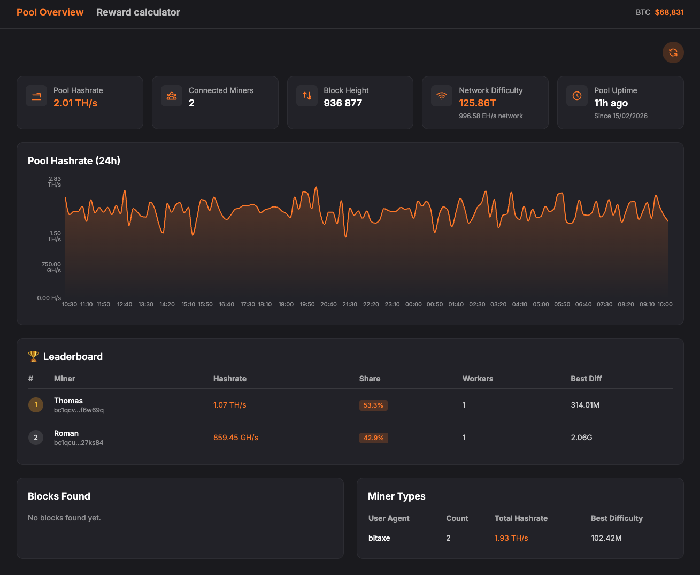

# Pool Overview

Dashboard for a Bitcoin mining pool: hashrate, miners, block height, network difficulty, uptime, 24h chart, leaderboard, blocks found, miner types, and reward calculator. Built with React, TypeScript, Vite, and Tailwind. Dark theme with orange accents.

---

## Demo

*(Screenshot: save as `docs/demo.png` to show it above.)*

---

## Quick start

- **Requirements:** Node.js 18+, npm
- **Install:** `npm install`
- **Dev:** `npm run dev` → http://localhost:5173 (API is proxied from `VITE_POOL_API_URL`)
- **Build:** `npm run build` → output in `dist/`
- **Preview build:** `npm run preview`

---

## What to change when deploying elsewhere

When you deploy to another server, pool, or set of wallets, change only the following.

### 1. Pool API address

| Where | What to do |
|-------|------------|
| **`.env`** | Copy `.env.example` to `.env` and set `VITE_POOL_API_URL` to your pool API URL (e.g. `http://your-pool:2019` or `https://pool.example.com`). No trailing slash. |
| **Development** | The same `.env` is used: `vite.config.ts` reads `VITE_POOL_API_URL` for the dev proxy. If unset, it falls back to `http://192.168.1.209:2019`. |
| **Production build** | Run `npm run build` **after** setting `.env` (or `export VITE_POOL_API_URL=...`). The URL is baked into the built app. |

So: **one variable, `VITE_POOL_API_URL`** – set it in `.env` (and in Docker build-arg when using Docker).

### 2. Tracked wallets (leaderboard)

| Where | What to change |
|-------|----------------|
| **`src/config.ts`** | Edit the array `TRACKED_WALLETS`: add/remove/rename `{ address: 'bc1q...', name: 'Display Name' }`. This is the **only** place for the wallet list; the UI has no add/remove. |

After changing `src/config.ts`, run `npm run build` again (or rebuild the Docker image).

### 3. Optional

| Where | What |
|-------|------|
| **`src/config.ts`** | `BLOCK_REWARD_BTC` – current block subsidy (default 3.125). Update after a halving if needed. |
| **`src/config.ts`** | `GITHUB_URL` – set to your repo URL for the footer link (e.g. `https://github.com/user/pool-overview`). |
| **`vite.config.ts`** | Default fallback for `VITE_POOL_API_URL` (the `192.168.1.209:2019` line) – change if you want a different default when `.env` is missing. |

---

## Summary

- **Pool address:** set **`VITE_POOL_API_URL`** in `.env` (and in Docker build when using Docker). Used by dev proxy and production build.
- **Wallets:** edit **`src/config.ts`** → `TRACKED_WALLETS` only.
- **GitHub link / block reward:** **`src/config.ts`** → `GITHUB_URL`, `BLOCK_REWARD_BTC`.

No other files need changes for a new deployment.
